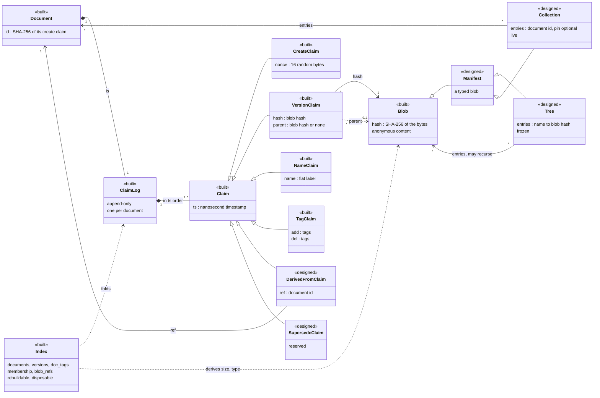
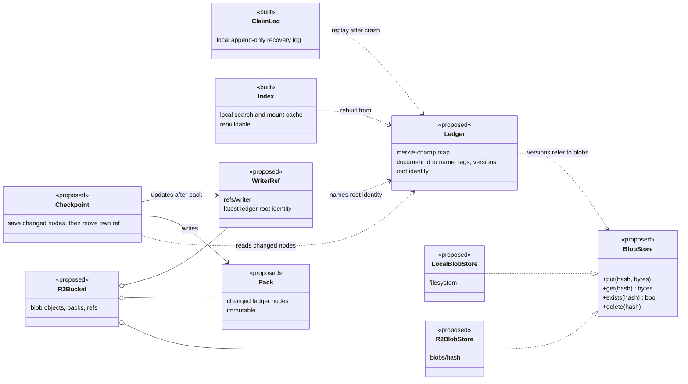
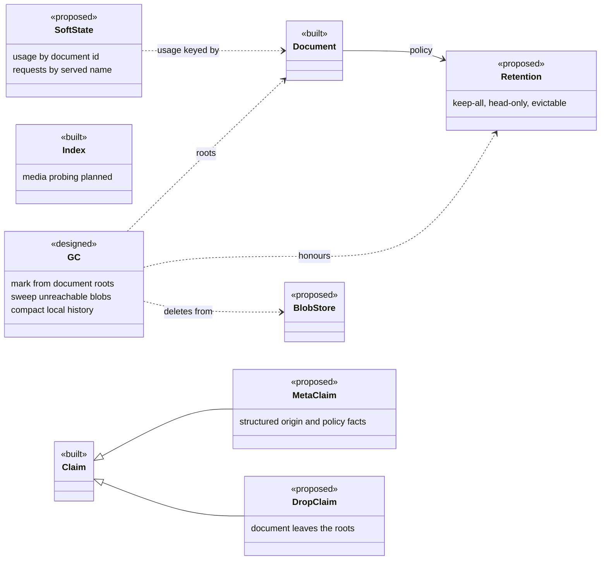
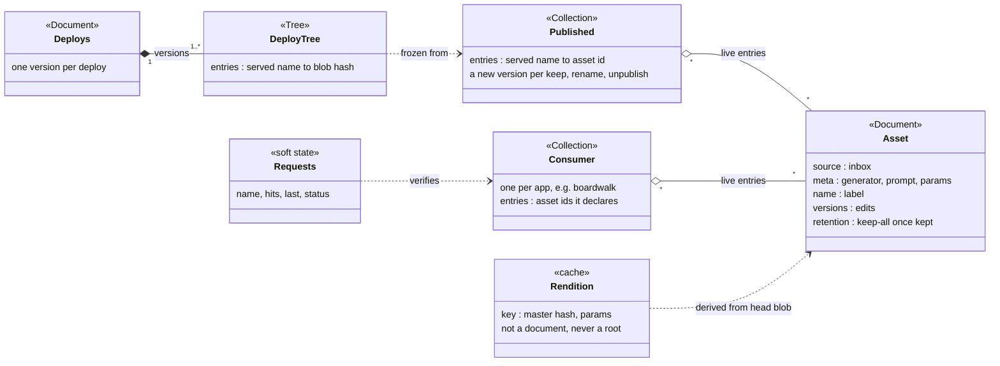
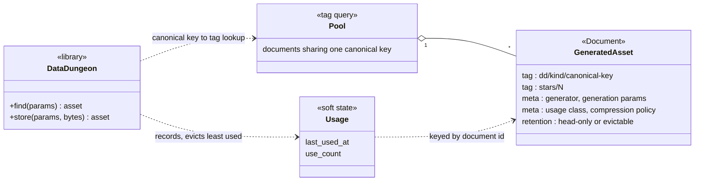
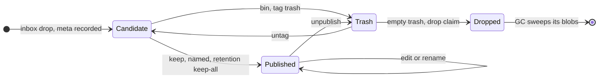

# transfs — the model

> **Status: proposal companion — not design.** Diagrams for
> [`proposal-substrate.md`](proposal-substrate.md), drawn against
> [`architecture.md`](architecture.md) and the current Crystal code. Where the two
> disagree, `architecture.md` wins; where drawing the model exposed a gap in the
> proposal, §6 says so.
>
> Diagrams are Mermaid, which GitHub renders in place. To preview locally,
> paste a block into [mermaid.live](https://mermaid.live).

---

## How to read it

In the first two diagrams the stereotype on each class is its **status**:

| stereotype | meaning |
|---|---|
| «built» | in transfs's code today |
| «designed» | specified in `architecture.md`, not built yet |
| «proposed» | from `proposal-substrate.md` or from this document — not decided |

Everything in the mapping diagrams (§3–§5) is proposed, so there the stereotype
names the **transfs construct** a role is built from instead — «Document»,
«Collection», «Tree», «cache», «soft state».

**Tags** are paths (`stars/4`, `type/image/jpeg`), as `architecture.md` §3
designs them: `=` is an alias for `/`, a document keeps only the deepest tag on
each lineage, and `set` replaces everything under a key. The current Crystal implementation has these tag operations. The mappings below use path form throughout.

---

## 1. The core model

What `architecture.md` specifies, and how much of it exists.

- **A document is its log.** There is no other per-document artifact: name, tags
  and head are folds over the claims, materialised only in the index.
- **A blob is not a document.** A document points at a blob by recording its
  hash in a version claim. One document points at many blobs over its history,
  and one blob can be pointed at by many documents. Two documents with the same
  bytes stay two documents.
- **Composites are documents** whose content is a manifest blob. Membership
  changes by appending a new version, never by member claims (§4).
- **Documents are the only GC roots** (§8). Blobs and manifests are the interior
  graph.
- **Not built yet:** composites — the index's `membership` table exists but stays
  empty — and the `derived-from` and `supersede` claims.

---

## 2. Proposed additions

The storage proposal keeps a live ledger on each writer's machine. R2 stores
blobs, packs of changed ledger nodes, and one ref per writer. This is a proposed
design; the current Crystal implementation still uses local claim logs and a
SQLite index, with no R2 backend.

A write changes the ledger and appends to the machine's claim log. A checkpoint
packs only the changed ledger pieces, writes the pack to R2, then updates that
writer's ref. A new machine reads a ref and loads ledger nodes as needed. A
reader combines the facts from the writer refs it trusts; its authority policy
chooses which version to show when they fork. The index remains a local cache;
losing it does not lose the ledger. See
[proposal §6](proposal-substrate.md#6-the-storage-seam) and merkle-champ's
`PERSISTENCE.md` for the storage mechanics.

The other proposed additions attach to the same documents and claims:

- **`MetaClaim`** holds facts that bytes cannot supply, such as generation
  parameters, without stuffing structured data into a tag.
- **`DropClaim`** removes a document from the live roots; §6.1 explains the
  tombstone question it raises.
- **`Retention`** belongs to a document. How it is stated remains open (§7).
- **`SoftState`** keeps usage and request records separately because their keys
  differ (§6.6).
- **Media probing** would add derived columns to the local index, as `size` and
  `type` already do. It needs no new truth-layer class.

---

## 3. curio on the model

| curio today | on the model |
|---|---|
| a file in `intake/` | an Asset document, created on arrival — `architecture.md` §7: "drop = archive a new document" |
| mjanime's per-batch `README.md` | a `meta` claim on each Asset, written when it arrives |
| keep | promote in place: name it, add a Published entry, set retention to keep-all (§6.4) |
| bin | tag `trash` |
| a file in `assets/` | an entry in Published |
| unpublish | remove the Published entry, tag `trash` |
| rename | a new Published version with the entry re-keyed; the URL history is Published's version history, replacing `.renames.tsv` |
| edit | a new version of the Asset; its Published entry is live and follows the head |
| `backup/history/` | the version DAG — nothing separate to keep |
| `manifest.tsv` | a view of Published from the index |
| renditions in `~/.cache/curio` | Rendition: keyed on the master's *content hash*, so an edit that changes no size within one second can no longer hide |
| `requests.tsv` | Requests, in the soft-state sidecar |
| deploy | a new version of Deploys, whose content is a Tree frozen from Published (§6.3) |
| rollback | a new version of Deploys pointing at an older Tree |

---

## 4. DataDungeon on the model

| DataDungeon today | on the model |
|---|---|
| canonical key | a tag DataDungeon computes from the params; transfs only indexes it. With path tags, `set` keeps it single-valued |
| pool | the documents sharing that tag |
| single-best | a pool of one, retention head-only; regenerating appends a version |
| `rating` (1–5) | tag `stars/N` — `architecture.md` uses `stars=4` as its own example |
| `permanent` | retention keep-all |
| `generator`, `generation` | a `meta` claim |
| `last_used_at`, `use_count` | Usage, in the soft-state sidecar |
| eviction | retention evictable, chosen by Usage, removed with a `drop` claim (§6.1) |
| `Storage` (local, R2) | gone from DataDungeon — it is transfs's storage seam |
| SQLite or Postgres index | an index backend; the index is rebuildable, so this is configuration, not migration |

---

## 5. The lifecycle of a curated asset

Curation is the durability boundary (proposal §3): an asset is fungible until
someone keeps it.

A deploy is not a state of an asset. It freezes whatever is Published at that
moment into a Tree (§6.3).

---

## 6. What drawing the model surfaced

Six points the proposal either missed or got wrong. The first four change what
the proposal said, and the proposal has been amended to match.

### 6.1 There is no way to remove a document

Eviction needs one, and so does emptying the trash. Deleting a local log file
would erase the evidence of the deletion; another writer could publish its
older view and make the document reappear.

**Proposed:** a `drop` claim. The ledger removes the document from the live
roots, and GC sweeps blobs nothing else reaches. A checkpoint carries the
resulting ledger state to R2. The local log may later be trimmed, but enough
history must survive to keep a dropped document from reappearing.

**Open:** the tombstone has to outlive compaction. Merge is a union of claims,
so a machine that compacted a dropped document away would get it back from a
peer that still holds its claims. That means a tombstone retention window, or
tombstones kept for good.

### 6.2 Served names are unique only if Published is keyed by name

The proposal claimed served names would be unique by construction. That holds
only if Published's entries are *served name → document id*. `architecture.md`
§4 leaves the entry form open and suggests collection names can come from the
index (id → document → name), and that form guarantees nothing: two documents
can carry the same name claim.

If served names are the keys:
- uniqueness is structural;
- a rename re-keys one entry, so URL history is Published's version history;
- a document's own `name` claim becomes its human label, which can differ from
  its URL.

curio enforces this today by checking at rename time, the kind of check this
proposal hoped to retire.

### 6.3 A deploy is a Tree, not a Collection

Live collection entries resolve to heads at read time, so a collection's
manifest hash does not freeze what gets served. §4's `tree` — name → blob hash,
"the static-website case" — does. A collection with every entry pinned would
freeze too, but a tree serves with no index lookup, which is what a static
server or CDN wants.

A tree must be rooted by a document (§8: documents are the only roots), hence
Deploys: its versions are the deploy history, `parent` links make that history
fork-detectable, and a rollback is a new version pointing at an older tree.

### 6.4 Keep should promote in place

The proposal had keep create a new curated document `derived-from` the
candidate. Drawn out, that loses provenance: once the candidate is evicted and
compacted, `derived-from` points at nothing and the generation parameters go
with it.

But an inbox drop already creates a document. So keep can promote *that*
document — name, Published entry, retention keep-all — and its provenance stays
in its own log. Curation becomes a retention change on one document, which is
the proposal's own "retention is a policy, not a second system." `derived-from`
remains for documents that are genuinely new, such as a composite assembled from
several sources.

### 6.5 Renditions are not documents

A rendition is a function of a master's bytes and the request parameters —
derived from content, so by principle 2 it is never truth. It belongs in a cache
keyed on *(master hash, params)*, is never a GC root, and needs its own eviction:
curio's size cap locally, a separate prefix with its own expiry on R2.

### 6.6 Requests are keyed by name, usage by document

Usage counts belong to documents. The request record cannot be keyed that way,
because its most useful rows are misses: a request for a name nothing publishes
is exactly what the record exists to catch. So the soft-state sidecar has two
tables with different keys.

---

## 7. Open in the model

1. **Published's entry form.** §6.2 needs `architecture.md` §4's open manifest question answered:
   name-keyed doc-ref entries, at least for this collection.
2. **Tombstone lifetime** under merge (§6.1).
3. **How retention is stated** — a single-valued tag via `set` (`retention/head`)
   or a `meta` field. A tag is queryable and visible in the facets for free, and
   retention is a property of the document rather than a relationship, so the
   tags-vs-collections rule allows it. Leaning tag.
4. **Local log after checkpoint.** Keep every claim on the writer, or trim the
   log and rely on retained ledger roots for older history?
5. **Where renditions live on R2**, and whether they're baked at deploy time
   rather than made on request (proposal open question 6).
